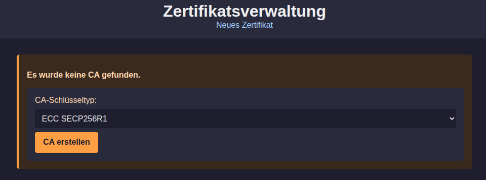
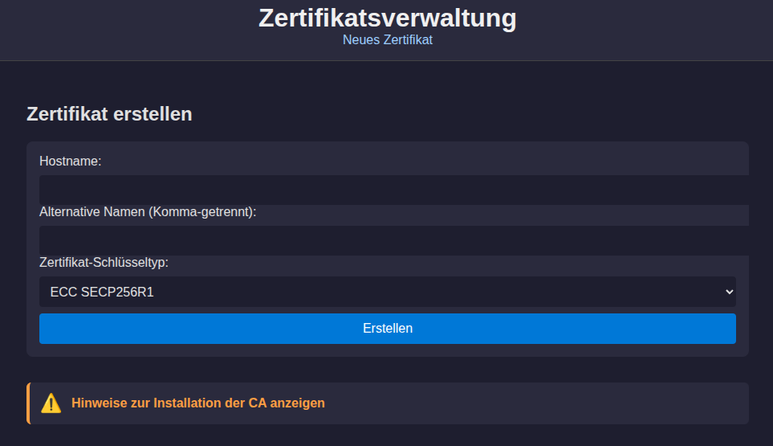
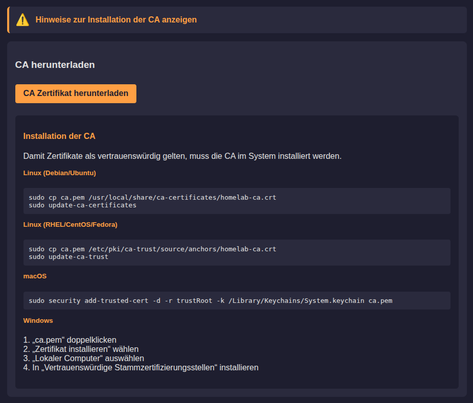

# caweb

A tiny certificate authority (CA) web UI for issuing and managing certificates. This repository contains a small FastAPI (uvicorn) web application and a Dockerfile so you can run it locally or inside a container.

## Features

- Simple web UI for CA operations (templates and static assets included)
- Run locally using the provided `uv` wrapper commands
- Build and run using Docker for deployment or sandboxed testing

## steps
Create ca


Create certificates


Install CA


## Requirements

- Python 3.11+ (or the version used in your environment)
- Docker (optional, for containerized runs)
- The repository uses `uv` helper commands for environment and process management — use these exact commands below.

---

## Local development / Run (recommended)

These commands assume you use the included `uv` helper for environment management.

1. Sync the environment (install/manage virtualenvs and/or tool-specific support):

```sh
uv sync
```

2. Compile dependencies from `pyproject.toml` to a static `requirements.txt`:

```sh
uv pip compile pyproject.toml -o requirements.txt
```

3. Install the compiled dependencies for Docker Image Check:

```sh
uv pip install -r requirements.txt
```

4. Run the app using uvicorn via the `uv` helper:

```sh
uv run uvicorn main:app
```

By default the app will bind to the host and port defined by the project (commonly 127.0.0.1:8000 or as configured). Check the logs printed by uvicorn for the exact listen address.

---

## Docker

Build the image:

```sh
docker build -t caweb .
```

Run interactively (temporary container):

```sh
# map port 2000 and mount a local CA directory
docker run --rm -p 2000:2000 -v /local-ca:/local-ca caweb
```

Run detached (long-running service) with dockerhub image:

```sh
docker run --name caweb -d -p 2000:2000 \
    -v /local-ca:/local-ca -v /local-ca/data:/data \
    --restart unless-stopped wlanboy/caweb:latest
```

Notes:
- The container expects a host directory mounted at `/local-ca` (adjust `-v` on the docker run command if you keep your data elsewhere).
- The app listens on port 2000 in the image — change the host port mapping if 2000 is unavailable.

---

## Troubleshooting & tips

- If the `uv` helper is not available on your shell, you can run the same commands using the proper Python venv and uvicorn directly (for example, activate a virtualenv and run `uvicorn main:app`).
- When editing templates or static files, restart the uvicorn server (or use an autoreload option during development, e.g. `uv run uvicorn main:app --reload`).
- Check `requirements.txt` and `pyproject.toml` for dependency updates. Re-run `uv pip compile` after modifying `pyproject.toml`.

