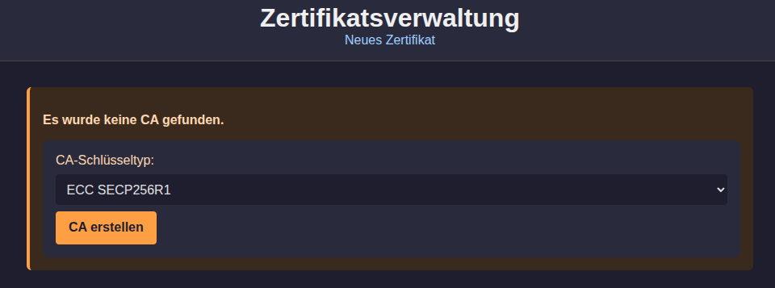
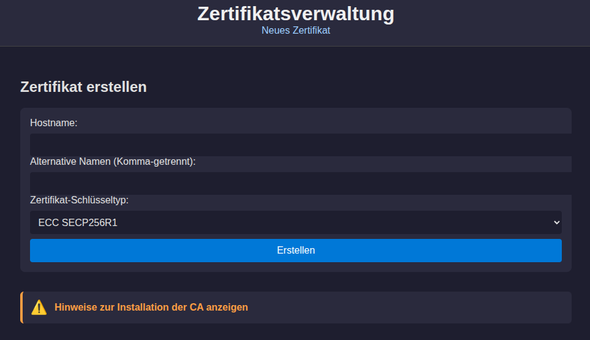
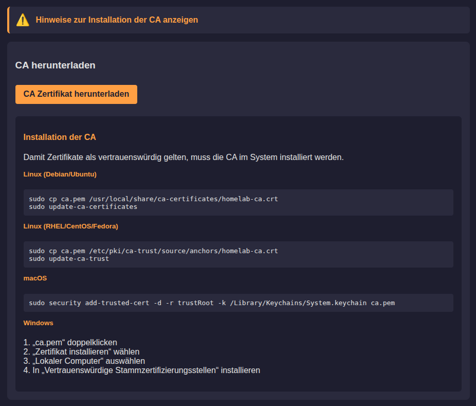

# caweb – Minimal Web UI for a Local Certificate Authority

caweb is a tiny, self‑contained Certificate Authority (CA) web interface for issuing and managing certificates.
It includes a lightweight FastAPI (uvicorn) application and a Dockerfile, allowing you to run it locally or inside a container with minimal setup.

The goal is to provide a simple, developer‑friendly CA tool without the complexity of full PKI suites — ideal for labs, internal services, development clusters, or automated certificate workflows.

## Features
- Simple web UI for CA operations  
Includes templates and static assets for issuing and managing certificates.

- RSA and ECC key support  
Supports RSA‑2048/4096 and elliptic curves P‑256, P‑384, P‑521.

- SAN support  
Issue certificates with DNS names and IP addresses.

- Multiple download formats  
Export .crt, .key, .pem, and .fullchain.crt.

- Two Docker images  
Standard image (~162 MB) and a minimal distroless variant (~77 MB).

- Helm chart for Kubernetes  
Includes optional support for Istio and cert‑manager integration.

- Local execution via uv wrapper  
Run the CA directly on your machine without Docker.

---

## Architecture

```text
  Browser
    |
    | HTTP :2000
    v
+---------------------------+
|     FastAPI / Uvicorn     |
|        (main.py)          |
|                           |
|  GET  /           (form)  |
|  POST /           (issue) |
|  POST /create-ca          |
|  GET  /download/...       |
+----------+----------------+
           |
    +------+-------+
    |               |
    v               v
+----------+  +-----------+
| /local-ca|  |   /data   |
|  CA key  |  |   certs   |
|  CA cert |  |  (per CN) |
+----------+  +-----------+

  cryptography library
  RSA 2048/4096
  ECC P-256/P-384/P-521
```

## Steps

Create ca


Create certificates


Install CA


## Requirements

- Python 3.12+
- Docker (optional, for containerized runs)
- The repository uses `uv` for environment and process management.

---

## Local development / Run (recommended)

These commands assume you use the included `uv` helper for environment management.

1. Sync the environment (install/manage virtualenvs and/or tool-specific support):

```sh
uv lock --upgrade
uv sync
uv run pytest
uv run pyright
uv run ruff check
```

2. Compile dependencies from `pyproject.toml` to a static `requirements.txt`:

```sh
uv pip compile pyproject.toml -o requirements.txt
```

3. Run the app using uvicorn via the `uv` helper:

```sh
export LOCAL_DATA_PATH="./data"
export LOCAL_CA_PATH="/local-ca"
uv run uvicorn main:app
```

By default the app will bind to the host and port defined by the project (commonly 127.0.0.1:8000 or as configured). Check the logs printed by uvicorn for the exact listen address.

---

## Docker

Build the image:

```sh
docker build -t caweb .
docker build -f DockerfileDistroless -t caweb:distro .

docker images --format "table {{.Repository}}\t{{.Tag}}\t{{.Size}}" | grep "caweb"
caweb    latest    162MB
caweb    distro     77MB
```

Run interactively (temporary container):

```sh
# map port 2000 and mount a local CA directory
docker run --rm -p 2000:2000 -v /local-ca:/local-ca -v /data:/data caweb

docker run --rm -p 2000:2000 -v /local-ca:/local-ca -v /data:/data caweb:distro
```

Run detached (long-running service) with dockerhub image:

```sh
docker run --name caweb -d -p 2000:2000 \
    -v /local-ca:/local-ca -v /local-ca/data:/data \
    --restart unless-stopped wlanboy/caweb:latest
```

## Notes

- The container expects a host directory mounted at `/local-ca` (adjust `-v` on the docker run command if you keep your data elsewhere).
- The app listens on port 2000 in the image — change the host port mapping if 2000 is unavailable.

---

## Troubleshooting & tips

- If the `uv` helper is not available on your shell, you can run the same commands using the proper Python venv and uvicorn directly (for example, activate a virtualenv and run `uvicorn main:app`).
- When editing templates or static files, restart the uvicorn server (or use an autoreload option during development, e.g. `uv run uvicorn main:app --reload`).
- Check `requirements.txt` and `pyproject.toml` for dependency updates. Re-run `uv pip compile` after modifying `pyproject.toml`.
